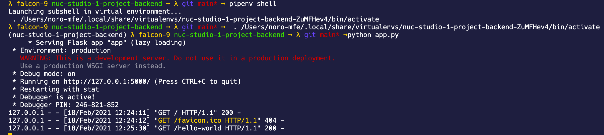

# FactBook Explorers

> Backend,RESTful API

Demo URLS

[https://factbook-explorers.herokuapp.com/population-levels](https://factbook-explorers.herokuapp.com/population-levels)

[https://factbook-explorers.herokuapp.com/gross-gdp](https://factbook-explorers.herokuapp.com/gross-gdp)

## Local development

To get started download the repo using SSH ([guide on SSH](https://docs.github.com/en/free-pro-team@latest/github/authenticating-to-github/generating-a-new-ssh-key-and-adding-it-to-the-ssh-agent))

```bash
git clone git@github.com:mannuelf/nuc-studio-1-project-backend.git

cd nuc-studio-1-project-backend/

```

## Install Package Manager

Install packages easily with a package manager.

### MAC

[Homebrew](https://brew.sh/)

### Windows

[Chocolatey](https://chocolatey.org/)

### Install pyenv

pyenv manages your python versions on your laptop. so you can install multiple versions, MacOS ships with 2.7 but we need >= 3.8.7

[installation instructions](https://github.com/pyenv/pyenv)

[🖥 MAC](https://github.com/pyenv/pyenv#homebrew-on-macos)

[💻 WINDOWS](https://chocolatey.org/packages/pyenv-win)

If all required dependencies are installed, to work on the project you must run it in a python environment using pipenv.

## Set python to 3.8.7

Install pyenv first:
[installation instructions](https://github.com/pyenv/pyenv)

```bash
pyenv global 3.8.7
```

The run this command in your shell to init pyenv.

```bash
eval "$(pyenv init -)"
```

Also add is to your .bash_profile. what is bash_profile? [click here to read](https://linuxize.com/post/bashrc-vs-bash-profile/).

## Install pipenv

[pipenv docs](https://pypi.org/project/pipenv/)

```bash
pip install pipenv
```

### Install PROJECT dependencies

There is a Pipfile, which lists all packages needed to run app.

```bash
pipenv install
```

### 1. Start server

Run this command to start a python environment, immediately afterwards run python app.py, this will start the server and you can begin.

```bash
pipenv shell
```

Start in DEVELOPMENT mode

```bash
export FLASK_ENV=development
```

then run the app

```bash
flask run
```

### 2. Endpoints

| Method | Endpoint                        | Description                                   |
| ------ | :------------------------------ | :-------------------------------------------- |
| GET    | /population-levels              | Gets all population level                     |
| GET    | /population-levels/country      | Gets all population level by country          |
| GET    | /population-levels/country/year | Gets all population level by country and year |
| GET    | /hello-world                    | Gets all test messages                        |
| GET    | /hello-world/{id}               | Get one message                               |
| POST   | /hello-world/                   | Post a message to API                         |

## System dependencies

You should use pyenv to install latest version of python

[https://github.com/pyenv/pyenv](https://github.com/pyenv/pyenv), use the automatic installer: [https://github.com/pyenv/pyenv-installer](https://github.com/pyenv/pyenv-installer)

## Development dependencies

- [flask](https://flask.palletsprojects.com/)
- [flask-sqlalchemy](https://flask-sqlalchemy.palletsprojects.com/)
- [flask-marshmallow](https://flask-marshmallow.readthedocs.io/en/latest/)
- [marshmallow-sqlalchemy](https://marshmallow-sqlalchemy.readthedocs.io/en/latest/)

### 1. Install pyenv

```bash
pip3 install pyenv
```

### 2. Start pipenv shell

```bash
pipenv shell
```

### 3. Install Project dependencies

```bash
pipenv install flask flask-sqlalchemy flask-marshmallow marshmallow-sqlalchemy
```

You are good to go, start building, now you can run the app inside of pipenv.

### 4. Run inside pipenv

Run server in development mode.

```bash
export FLASK_ENV=development
```

Start development server.

```bash
flask run
```

In the console you should see:


Navigate to:
[http://localhost:5000/hello-world](http://localhost:5000/hello-world)

#### 4.1 Create a db, inside pipenv (only need to do this once one a fresh app.)

```bash
$ python app.py
>> from app import db
>> db.create_all()
>> exit()
```

## 🚉 Contributing code

We will use peer review in the form of Pull Requests. You must make a feature branch before starting to code. The `main` branch must always be clean and deployable at all times, do not work on `main` branch.

Lessons on branches and merging can be seen here: [:tv: Watch](https://github.com/Noroff-Fagskole/campus-advisor-training-mannuelf/tree/master/Module%201)

## Contribution Guidelines

We are using Github Issue and Project board to manage tasks.

[https://github.com/mannuelf/nuc-studio-1-project-backend/issues](https://github.com/mannuelf/nuc-studio-1-project-backend/issues)

[https://github.com/mannuelf/nuc-studio-1-project-backend/projects/1](https://github.com/mannuelf/nuc-studio-1-project-backend/projects/1)

### To contribute:

Create and issue using the issus board.

1. Assign it to yourself and
2. Label it using appropriate label
3. 

### Coding

1. keep `main` branch clean and deployable at all times, do not code on it.
2. Fork Repo or 
3. if already on the team create a feature branch
4. Work on your task
5. Create a Pull Request.
